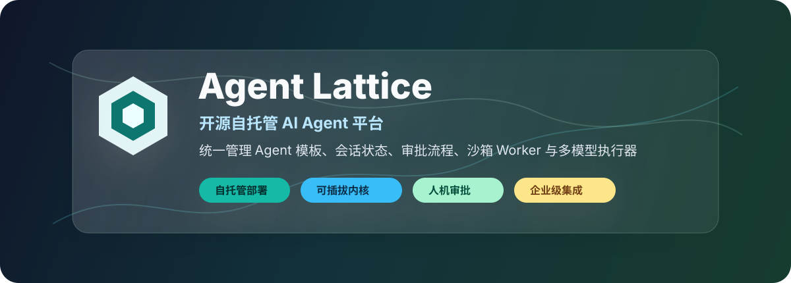
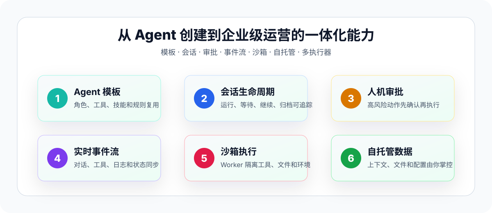
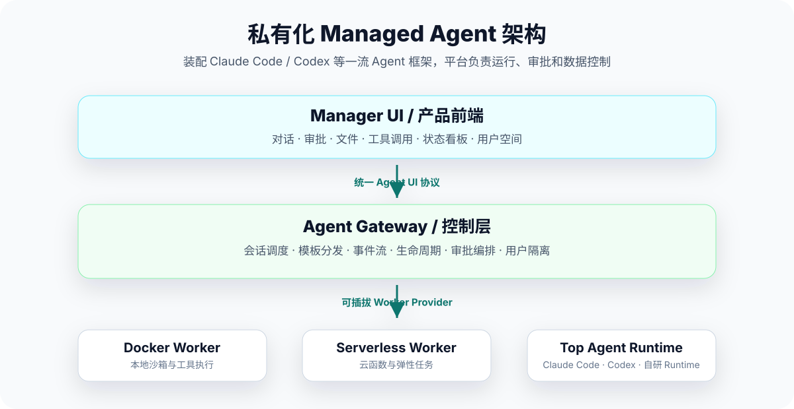

<div align="center">



# Agent Lattice

**开源自托管 AI Agent 平台 · Agent 管理系统 · 可插拔执行器 · 企业级人机协作底座**

面向 Claude、OpenAI、Gemini、开源模型或自研执行器等多种 Agent Runtime，统一管理 Agent 模板、用户空间、会话状态、工具调用、审批流程与运行沙箱。

[官网](https://agent-lattice.cn) · [在线 Demo](https://demo.agent-lattice.cn) · [项目文档](https://github.com/agent-lattice/agent-lattice/tree/main/docs) · [GitHub 讨论](https://github.com/agent-lattice/.github/discussions)

</div>

---

## 一个可嵌入你产品的 Agent 基础设施

Agent Lattice 是面向 AI Agent 应用、企业内部 Copilot、研发自动化平台和私有化智能助手的开源 Agent 管理平台。它提供一套自托管、可扩展、可替换内核的 Agent 基础设施，让团队不用从零搭建会话管理、权限隔离、任务审批、文件上下文、执行沙箱和实时交互能力。

如果你正在建设这些场景，Agent Lattice 可以作为产品底座：

| 场景 | Agent Lattice 提供什么 |
|:--|:--|
| **企业内部 AI 助手** | 用户隔离、数据自控、操作审批、私有化部署 |
| **研发 Agent 平台** | 沙箱执行、文件变更追踪、终端输出、任务生命周期管理 |
| **SaaS 产品内嵌 Agent** | 统一 Agent UI 协议、可复用管理界面、可插拔执行器 |
| **多模型 Agent 实验平台** | 前端不变，后端执行器可切换，降低模型和供应商绑定 |

---

## 为什么选择 Agent Lattice？

很多团队在把 AI Agent 接入真实产品时，会很快遇到同一组问题：

| 常见阻碍 | Agent Lattice 的解法 |
|:--|:--|
| Agent 内核一换，前端和业务流程就要重写 | 用统一 Agent UI 协议隔离产品界面与后端执行器 |
| 对话、文件、工具调用和审批状态分散在不同系统 | 用 Gateway 统一调度会话、状态、事件流和用户空间 |
| 只想私有化部署，但托管服务无法满足数据合规要求 | 支持自托管部署，数据留在你自己的服务器和存储中 |
| 高风险操作缺少人类确认机制 | 内置人机审批流程，让 Agent 在关键节点暂停等待确认 |
| 多用户、多项目、多 Agent 难以管理 | 通过模板、空间和生命周期管理形成标准化运营能力 |

---

## 产品能力



<table>
<tr>
<td width="50%">

### Agent 模板化管理

把角色设定、系统提示词、工具权限、技能配置和运行规则沉淀为模板。不同用户或项目可以从模板创建独立 Agent 实例，既复用标准能力，也保留隔离空间。

</td>
<td width="50%">

### 会话与生命周期管理

统一追踪 Agent 从创建、运行、等待审批、继续执行到归档的完整过程。对话历史、工具调用、终端输出和文件变更都可以被管理和回放。

</td>
</tr>
<tr>
<td width="50%">

### 人机协作审批

当 Agent 准备执行敏感操作、修改关键文件或调用高风险工具时，平台可以暂停任务，等待人类确认后再继续，适合企业安全和研发流程。

</td>
<td width="50%">

### 实时交互体验

对话流、工具执行、日志输出、状态变化和审批请求通过统一事件流推送到界面，让 Agent 的执行过程可见、可控、可追踪。

</td>
</tr>
<tr>
<td width="50%">

### 可插拔 Agent 执行器

平台面向可替换执行器设计，可以逐步接入 Claude、OpenAI、Gemini、本地开源模型、自研 Agent Runtime 或云函数 Worker，减少对单一供应商的依赖。

</td>
<td width="50%">

### 自托管与数据自主

Agent Lattice 可以部署在你自己的基础设施中。对话、上下文、文件和配置由你管理，便于满足私有化、审计、合规和成本控制需求。

</td>
</tr>
</table>

---

## 架构概览



Agent Lattice 将 AI Agent 平台拆成三层：

| 层级 | 组件 | 作用 |
|:--|:--|:--|
| **交互层** | Manager UI | 提供对话、审批、文件、工具调用和 Agent 管理界面 |
| **控制层** | Agent Gateway | 负责用户空间、会话调度、状态追踪、模板分发和事件流 |
| **执行层** | Worker / Sandbox | 运行具体 Agent 内核，隔离工具、文件系统、凭证和执行环境 |

你的产品只需要对接统一协议，不需要把业务代码绑定到某个具体模型、CLI 或 Agent Runtime。

---

## 适合谁使用？

- **AI 产品团队**：想在现有 SaaS、CRM、DevTool 或内部系统中嵌入 Agent 能力。
- **企业 IT / 平台工程团队**：需要私有化部署、权限隔离、审计追踪和数据自主。
- **研发效能团队**：希望把代码 Agent、运维 Agent、文档 Agent 纳入统一管理。
- **Agent 创业团队**：想快速搭建可运营的 Agent 平台，而不是只做一个聊天窗口。

---

## 与托管 Agent 服务的区别

| 对比项 | 常见托管 Agent 服务 | Agent Lattice |
|:--|:--|:--|
| **部署方式** | 主要运行在服务商云端 | 自托管，部署位置由你决定 |
| **数据归属** | 会话和上下文通常进入第三方平台 | 数据留在自己的服务器和存储中 |
| **Agent 内核** | 常绑定固定模型或固定 Runtime | 可插拔执行器，降低供应商锁定 |
| **产品集成** | 更偏独立工具或托管控制台 | 可作为业务产品内的 Agent 底座 |
| **审批流程** | 可定制空间有限 | 面向人机协作和高风险操作确认设计 |
| **运行环境** | 通常不可控 | Docker、本地服务、云函数或自定义 Worker |
| **开源属性** | 多数闭源 | 开源，便于审计、二次开发和私有化交付 |

---

## 技术栈

| 模块 | 技术 |
|:--|:--|
| **后端** | Python, FastAPI |
| **前端** | React, Next.js, TypeScript, shadcn/ui, Tailwind CSS |
| **运行时** | Docker, Worker Provider, Serverless Runtime |
| **存储** | 文件系统优先，可扩展到数据库和对象存储 |
| **协议** | 统一 Agent UI 事件协议，可对接多种 Agent Runtime |

---

## 快速开始

```bash
git clone https://github.com/agent-lattice/agent-lattice.git
cd agent-lattice
make dev-up
```

也可以直接访问在线体验环境：

[demo.agent-lattice.cn](https://demo.agent-lattice.cn)

---

## 路线图

| 状态 | 方向 |
|:--|:--|
| 已落地 | Agent 模板、用户管理、基础 Manager UI、Gateway 调度框架 |
| 进行中 | 会话持久化、任务回放、审批体验优化、Worker Provider 抽象 |
| 规划中 | 安全沙箱标准化、凭证代理、多 Agent 协同编排、企业级审计 |

---

## 参与项目

Agent Lattice 正在持续迭代，欢迎产品反馈、场景讨论、文档补充和代码贡献。

- 提交问题或功能建议：[GitHub Issues](https://github.com/agent-lattice/.github/issues)
- 分享使用场景和想法：[GitHub Discussions](https://github.com/agent-lattice/.github/discussions)
- 贡献代码：Fork 项目，创建分支并提交 Pull Request
- 了解更多：[agent-lattice.cn](https://agent-lattice.cn)

---

<div align="center">

**Agent Lattice：让 AI Agent 成为你产品的一部分，而不是把你的产品交给某个 Agent。**

[MIT License](https://github.com/agent-lattice/agent-lattice/blob/main/LICENSE)

</div>
